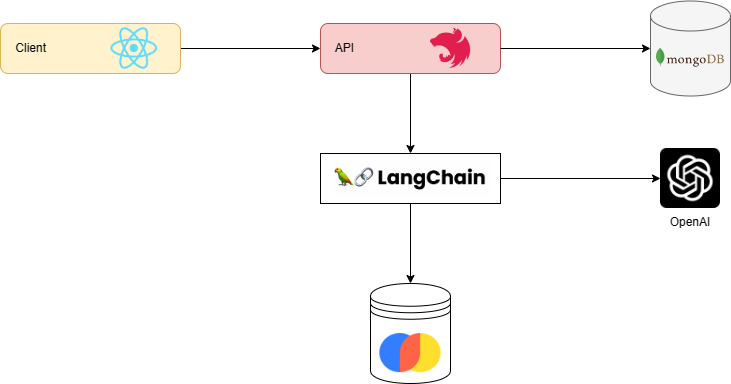

<div align="center">
	<p>
		<a href="https://sonarcloud.io/summary/new_code?id=foxminchan_GovermentLLM" target="_blank">
			
		</a>
	  <a href="https://gitpod.io/new/#https://github.com/foxminchan/GovernmentChatbot" target="_blank">
			
		</a>
	</p>
</div>

<hr>

<h1 align="justify"> Government Chatbot - A LLM Application 🤖</h1>

<p align="center">
Government Chatbot is a monorepo project built with <a href="https://nx.dev/">Nx</a> technology. It is a set of extensible dev tools for monorepos, which helps you develop like Google, Facebook, and Microsoft.
</p>

<h1>Table of Contents</h1>

- [Overview](#overview)
- [Methodology](#methodology)
- [Technology Stack](#technology-stack)
- [Getting Started](#getting-started)
	- [💻 Infrastructure](#-infrastructure)
	- [📦 Services](#-services)
	- [🛠️ Setup](#️-setup)
	- [🚀 Running the application](#-running-the-application)
- [Dependency Graph](#dependency-graph)
- [License](#license)

# Overview

<p align="justify">
This repository hosts an innovative chatbot solution that intelligently manages and streamlines the process of resolving diverse administrative procedures. Powered by advanced language models, the chatbot ensures smooth navigation through complex tasks, ensuring an intuitive and user-friendly experience for all users.
</p>

# Methodology

<p align="justify">
Retrieval Augmented Generation (RAG) represents an innovative paradigm that harnesses the combined strengths of the ChatGPT API, LangChain, and Weaviate. This sophisticated integration facilitates a seamless amalgamation of information retrieval and content generation, resulting in outputs that are not only accurate and coherent but also infused with creativity and depth. By capitalizing on the individual capabilities of each component, RAG effectively bridges the gap between data-driven precision and the art of nuanced communication, catering to a diverse spectrum of user requirements and preferences.
</p>



# Technology Stack

- [React](https://reactjs.org/)
- [NestJS](https://nestjs.com/)
- [Pulumi](https://www.pulumi.com/)
- [LangChain](https://www.langchain.com/)
- [Weaviate](https://weaviate.io/)
- [SonarCloud](https://sonarcloud.io/)
- [Grafana](https://grafana.com/), [Prometheus](https://prometheus.io/), [Loki](https://grafana.com/oss/loki/), [Tempo](https://grafana.com/oss/tempo/), [Promtail](https://grafana.com/docs/loki/latest/send-data/promtail/)

# Getting Started

## 💻 Infrastructure

<ul>
	<li align="justify">
		<b><a href="https://www.docker.com/" target="_blank">Docker</a></b> - Docker is an open platform for developing, shipping, 	and running applications.
	</li>
	<li align="justify">
		<b><a href="https://docs.microsoft.com/en-us/windows/wsl/install-win10" target="_blank">WSL 2</a></b> - The Windows Subsystem for Linux lets developers run a GNU/Linux environment.
	</li>
	<li align="justify">
		<b><a href="https://nodejs.org/en/" target="_blank">Nodejs</a></b> - Node.js® is a JavaScript runtime built on Chrome's V8 JavaScript engine.
	</li>
	<li align="justify">
		<b><a href="https://www.npmjs.com/" target="_blank">npm</a></b> - npm is the package manager for the Node JavaScript platform.
	</li>
	<li align="justify">
		<b><a href="https://www.python.org/" target="_blank">Python</a></b> - Python is a programming language that lets you work quickly and integrate systems more effectively.
	</li>
</ul>

## 📦 Services

<ul>
	<li align="justify">
		<b><a href="https://www.mongodb.com/" target="_blank">MongoDB</a></b> - MongoDB is a general purpose, document-based, distributed database built for modern application developers and for the cloud era.
	</li>
	<li align="justify">
		<b><a href="https://openai.com/product" target="_blank">ChatGPT API</a></b> - ChatGPT is a large-scale pretrained generative model for conversation. It is trained on 147M conversation-like exchanges extracted from Reddit comment chains over a period spanning from 2005 through 2017.
	</li>
	<li align="justify">
		<b><a href="https://weaviate.io/" target="_blank">Weaviate</a></b> - Weaviate is an open-source vector database. It allows you to store data objects and vector embeddings from your favorite ML-models, and scale seamlessly into billions of data objects.
	</li>
</ul>

## 🛠️ Setup

First, clone the repository to your local machine:

```bash
git clone https://github.com/foxminchan/GovernmentLLM
```

Next, navigate to the root directory of the project and install the dependencies:

```bash
npm install --force
```

## 🚀 Running the application

For the website, you can run the following command:

```bash
npx nx serve website
```

For the docs, you can run the following command:

```bash
npx nx serve docs
```

For the API , you can run the following command:

```bash
npx nx serve api
```

<p align="justify">

> **Warning**
> If you run the API in the first time, you need to generate the `prisma` client by running the following command:
>
> ```bash
> cd apps/api && npx prisma generate
> ```
>
> Make sure you have setup the environment variables in the `.env` file for API and Website. The sample of the `.env` file is in the `.env.example` file.

</p>

# Dependency Graph

You can see the dependency graph of the project by running the following command:

```bash
npx nx dep-graph
```

# License

This project is licensed under the MIT License - see the [LICENSE](LICENSE) file for details
