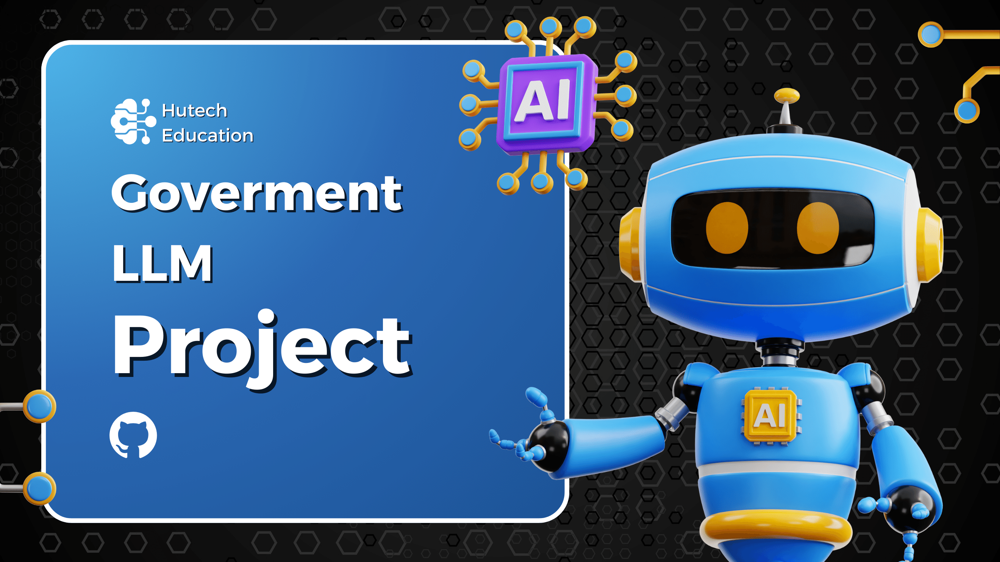
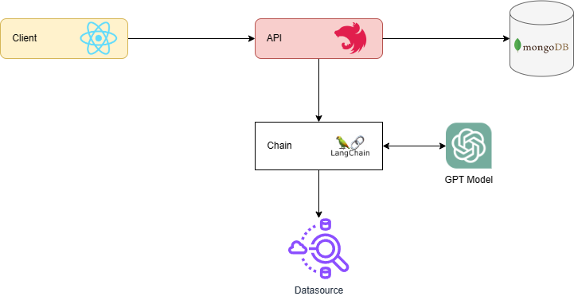
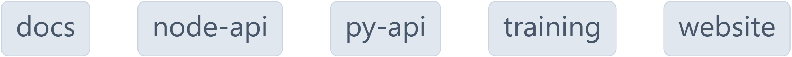

<div align="center">
	<p>
		<a href="https://sonarcloud.io/summary/new_code?id=foxminchan_GovermentLLM" target="_blank">
			
		</a>
	  <a href="https://gitpod.io/new/#https://github.com/foxminchan/GovermentLLM" target="_blank">
			
		</a>
	</p>
</div>

<hr>

<h1 align="justify"> Goverment Chatbot - A LLM Application 🤖</h1>

<p align="center">
	Goverment Chatbot is a monorepo project built with <a href="https://nx.dev/">Nx</a> technology. It is a set of extensible dev tools for monorepos, which helps you develop like Google, Facebook, and Microsoft.
</p>

# Overview

<p align="justify">
This repository hosts an innovative chatbot solution that intelligently manages and streamlines the process of resolving diverse administrative procedures. Powered by advanced language models, the chatbot ensures smooth navigation through complex tasks, ensuring an intuitive and user-friendly experience for all users.
</p>



# Getting Started

## 💻 Infrastructure

<ul>
	<li align="justify">
		<b><a href="https://www.docker.com/" target="_blank">Docker</a></b> - Docker is an open platform for developing, shipping, 	and running applications.
	</li>
	<li align="justify">
		<b><a href="https://nodejs.org/en/" target="_blank">Nodejs</a></b> - Node.js® is a JavaScript runtime built on Chrome's V8 JavaScript engine.
	</li>
	<li align="justify">
		<b><a href="https://www.npmjs.com/" target="_blank">npm</a></b> - npm is the package manager for the Node JavaScript platform.
	</li>
</ul>

## 📦 Services

<ul>
	<li align="justify">
		<b><a href="https://www.mongodb.com/" target="_blank">MongoDB</a></b> - MongoDB is a general purpose, document-based, distributed database built for modern application developers and for the cloud era.
	</li>
	<li align="justify">
		<b><a href="https://openai.com/product" target="_blank">ChatGPT API</a></b> - ChatGPT is a large-scale pretrained generative model for conversation. It is trained on 147M conversation-like exchanges extracted from Reddit comment chains over a period spanning from 2005 through 2017.
	</li>
</ul>

## 🛠️ Setup

First, clone the repository to your local machine:

```bash
git clone https://github.com/foxminchan/GovermentLLM
```

Next, navigate to the root directory of the project and install the dependencies:

```bash
npm install --force
```

## 🚀 Running the application

For the API, you can run the following command:

```bash
npx nx serve api
```

For the website, you can run the following command:

```bash
npx nx serve website
```

For the docs, you can run the following command:

```bash
npx nx serve docs
```

# Dependency Graph

You can see the dependency graph of the project by running the following command:

```bash
npx nx dep-graph
```

Here is the dependency graph of the project:

<p align="center">
	
</p>

# License

This project is licensed under the MIT License - see the [LICENSE](LICENSE) file for details
