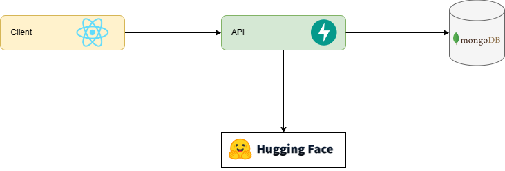

<div align="center">
	<p>
		<a href="#" target="_blank">
			
		</a>
		<a href="https://sonarcloud.io/summary/new_code?id=foxminchan_GovermentLLM" target="_blank">
			
		</a>
	  <a href="https://gitpod.io/new/#https://github.com/foxminchan/GovernmentChatbot" target="_blank">
			
		</a>
	</p>
</div>

<hr>

<h1 align="justify"> Government Chatbot - A LLM Application 🤖</h1>

<p align="center">
Government Chatbot is a monorepo project built with <a href="https://nx.dev/">Nx</a> technology. It is a set of extensible dev tools for monorepos, which helps you develop like Google, Facebook, and Microsoft.
</p>

<h1>Table of Contents</h1>

- [Overview](#overview)
- [Methodology](#methodology)
  - [🤖 Retrieval Augmented Generation](#-retrieval-augmented-generation)
  - [🤗 Train Sentiment Analysis](#-train-sentiment-analysis)
- [Getting Started](#getting-started)
  - [💻 Infrastructure](#-infrastructure)
  - [📦 Services](#-services)
  - [🛠️ Setup](#️-setup)
  - [🚀 Running the application](#-running-the-application)
- [Dependency Graph](#dependency-graph)
- [License](#license)

# Overview

<p align="justify">
This repository hosts an innovative chatbot solution that intelligently manages and streamlines the process of resolving diverse administrative procedures. Powered by advanced language models, the chatbot ensures smooth navigation through complex tasks, ensuring an intuitive and user-friendly experience for all users.
</p>

# Methodology

## 🤖 Retrieval Augmented Generation

<p align="justify">
Our approach, Retrieval Augmented Generation, combines the prowess of ChatGPT API, LangChain, ChromaDB, and Nestjs. This integration enables an advanced system that seamlessly merges information retrieval with sophisticated content generation, delivering precise and creative outputs.
</p>


## 🤗 Train Sentiment Analysis

<p align="justify">
Our method, Train Sentiment Analysis, leverages FastAPI, Hugging Face, and PhoBERT to develop highly accurate sentiment analysis models. This enables businesses to extract valuable insights from textual data swiftly and precisely.
</p>



# Getting Started

## 💻 Infrastructure

<ul>
	<li align="justify">
		<b><a href="https://www.docker.com/" target="_blank">Docker</a></b> - Docker is an open platform for developing, shipping, 	and running applications.
	</li>
	<li align="justify">
		<b><a href="https://docs.microsoft.com/en-us/windows/wsl/install-win10" target="_blank">WSL 2</a></b> - The Windows Subsystem for Linux lets developers run a GNU/Linux environment.
	</li>
	<li align="justify">
		<b><a href="https://nodejs.org/en/" target="_blank">Nodejs</a></b> - Node.js® is a JavaScript runtime built on Chrome's V8 JavaScript engine.
	</li>
	<li align="justify">
		<b><a href="https://www.npmjs.com/" target="_blank">npm</a></b> - npm is the package manager for the Node JavaScript platform.
	</li>
	<li align="justify">
		<b><a href="https://www.python.org/" target="_blank">Python</a></b> - Python is a programming language that lets you work quickly and integrate systems more effectively.
	</li>
</ul>

## 📦 Services

<ul>
	<li align="justify">
		<b><a href="https://www.mongodb.com/" target="_blank">MongoDB</a></b> - MongoDB is a general purpose, document-based, distributed database built for modern application developers and for the cloud era.
	</li>
	<li align="justify">
		<b><a href="https://openai.com/product" target="_blank">ChatGPT API</a></b> - ChatGPT is a large-scale pretrained generative model for conversation. It is trained on 147M conversation-like exchanges extracted from Reddit comment chains over a period spanning from 2005 through 2017.
	</li>
	<li align="justify">
		<b><a href="https://colab.research.google.com/" target="_blank">Google Colab</a></b> - Google Colab is a free cloud service and it supports free GPU! You can;
		</b>
	</li>
</ul>

## 🛠️ Setup

First, clone the repository to your local machine:

```bash
git clone https://github.com/foxminchan/GovernmentLLM
```

Next, navigate to the root directory of the project and install the dependencies:

```bash
npm install --force
```

## 🚀 Running the application

For the website, you can run the following command:

```bash
npx nx serve website
```

For the docs, you can run the following command:

```bash
npx nx serve docs
```

For the API `(node only)`, you can run the following command:

```bash
npx nx serve node-api
```

For the API `(python only)`, you can run the following command:

```bash
cd apps/py-api && python.exe -m uvicorn main:app --reload
```

> Note:
> If you want to run with Nx, make sure you have installed `poetry` and `uvicorn` globally.

# Dependency Graph

You can see the dependency graph of the project by running the following command:

```bash
npx nx dep-graph
```

# License

This project is licensed under the MIT License - see the [LICENSE](LICENSE) file for details
